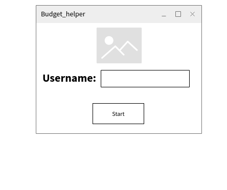
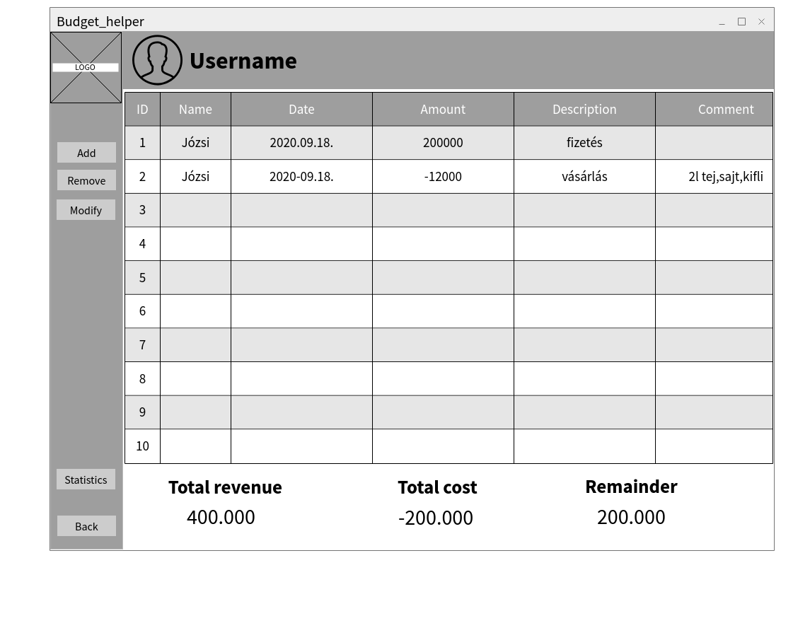
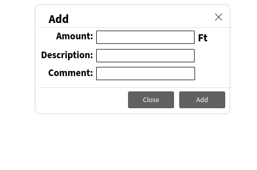
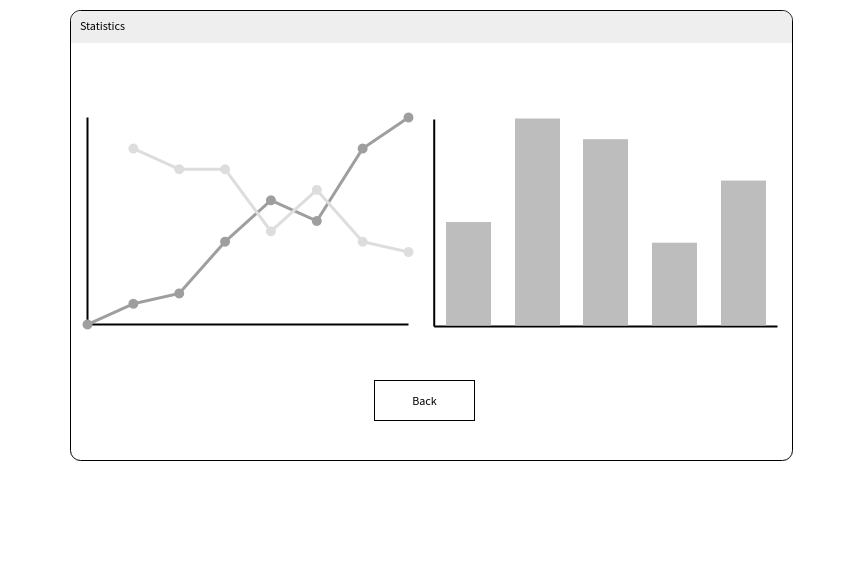

# Funkcionális specifikáció

## A rendszer céljai és nem céljai

### A rendszer célja

- A rendszer célja, hogy egy egyszerű áttekintést mutasson a felhsználó által költött pénzmennyiségekre akár napi, akár havi bontásban.
- A rendszer lehetővé teszi, hogy a felhasználó egy adott elköltött pénzösszeg bejegyzéséhez megjegyzést fűzhessen, például olyasmit, hogy mire költötte azt a pénzt (számlafizetés, buszbérlet, bevásárlás, stb.)
- Emellett a rendszerbe pénzbevételt is lehet bevinni (pl. havi fizetés, zsebpénz, ösztöndíj, stb.)

### A rendszernek nem célja

- Nem kikötés, hogy a rendszer minden egyes időpillanatban a felhasználó valós budget-jét mutassa, hiszen ez a felhasználó igyekezetétől függ, attól, hogy mennyire veszi komolyan költekezéseinek feljegyzését.
- A rendszer nem fér hozzá a felhasználó bankszámla egyenlegéhez és nem tárol érzékeny vagy személyes információkat.
- Minden egyes bejegyzést a felhasználó maga kell bevigyen a rendszerbe.

## [Jelenlegi helyzet leírása](kovspecifikacio.md#1-jelenlegi-helyzet)

## [Vágyálom rendszer](kovspecifikacio.md#2-vágyálom-rendszer)

A megrendelőnk elképzeléseit kiegészítve, amely a hivatkozás által az alcímre kattintva érhető el. 

- Célunk egy könnyen átlátható, nem bonyolult, egyszerűen kezelhető, grafikus felülettel ellátott
alkalmazás kifejlesztése, amely segítséget nyújt a mindennapokban.

- Ennek megvalósítására az egyszerű és könnyen áttekinthető, mégis lényegretörő oszlop vagy 
vonaldiagrammokhoz kell folyamodnunk.

- Mindemellett a GUI-nak letisztultnak kell lennie, figyelnünk kell a megfelelő színek kiválasztására, minél jobban 
kivehetőek legyenek a gombok, és a későbbiekben akár már megszokásból színek alapján is képes legyen a felhasználó megjegyezni és hozzátársítani a funkciót az
adott gombhoz.

- Amennyiben a felhasználó hibásan használja az alkalmazást, érthető leírást kapjon arról, hogy mit rontott el, majd minél hamarabb térhessen vissza az alkalmazás használatához.

- A cél, hogy az itt leírtakhoz próbáljunk minél jobban közelíteni az alkalmazás végleges változatában.

## [Követelmény lista](kovspecifikacio.md#6-követelménylista)

## Képernyőtervek

&nbsp;&nbsp;&nbsp;&nbsp; A program indításakor a következő látvány fog elénk tárulni:

A felhasználó itt beírja a felhasználó nevét majd a start gombra kattintva indul el az applikáció.

Az applikáció indítását követően egy ehhez hasonló felület fog minket fogadni.

Itt az Add gombra kattintva felugrik majd egy újabb ablak, amelyben képesek vagyunk új mezőt felvenni az adatbázisunkba.

Ez az alábbi képhez hasonlóan fog kinézni(A programunkban a magyar nyelv majd lesz preferált):

- Amount: beírhatjuk az összeget.
- Description: ez tartalmazza a leírást, tehát azt, hogy az adott összeg felvételét milyen gazdasági esemény váltotta ki.
- Comment: Itt mehetünk bele a részletekben. Lényegében a descriptionban leírtakat fejtsük ki.

A modify: itt leszünk képesek majd módosítani egy megadott mezőt az adatbázisból.

Remove: ezzel leszünk képesek törölni egy megadott mezőt az adatbázisunkból.

És a programunk utolsó funkciója a Statistics gombbal érhető majd el, amely a diagrammos megjelenítést teszi majd lehetővé.

Ez a következőhöz hasonlóképpen fog kinézni:

Itt majd a back gomb használatával tudunk vissza navigálni az applikációs ablakra.

## Forgatókönyvek

-Minden további funkcióhoz a felhasználó először elindítja az alkalmazást és az általa megadott felhasználó névvel bejelentkezik.

### Cél: Bevétel és kiadás felvétele

- Az alkalmazás menüjének tekinthető fő ablakba érkezve a bal oldali menüben a 'hozzáad' gombra kattint.
- A felugró ablakban az 'Összeg'-hez beírja a bevétel vagy kiadás értékét, ezt követően a 'Leírás'-hoz megadja hogy honnan, vagy mire kapott illetve költött pénzt.
- Opcionálisan hozzá adhat egy emlékeztetőt vagy kommentet a 'Megjegyzés' pontban, ami a táblázat szerű fő ablakban segíti a tájékozódást.
- A 'Hozzáad' gombra kattintva a felugró ablak bezárul és az összeg megjelenik a táblázatban.

### Cél: A táblázatba felvett elem módosítása vagy törlése

- A módosítani vagy törölni kívánt bejegyzés kijelölése.
- A táblázat bal oldalán a 'Módosít' gombra kattintva újra felugrik a hozzáadásnál megnyíló ablak, melyben módosíthatók a bejegyzés elemei.
- A táblázat bal oldalán a 'Töröl' gombra kattintba egy figyelmeztetés ugrik fel, ahol a folyamat megerősíthető vagy visszavonható.

### Cél: Statisztikák megjelenítése

- A táblázat bal alsó sarkában a kilépés gomb felett található a statisztikák megjelenítésére szolgáló ikonnal ellátott gomb.
- A gombot megnyomva felugrik a 'Statisztikák' ablak, amelyen a felhasználó látni fogja a költési szokásaira vonatkozó fontosabb ábrákat és diagramokat.

### Cél: Változtatások mentése, program bezárása

- A felhasználó a bal alsó sarokban található 'Exit' gombra kattint.
- Egy felugró ablakban megerősítheti vagy elvetheti a használat közben bevitt értékeket, módosításokat, illetve visszatérhet az alkalmazásba.
- A módosítások mentése vagy elvetése után a program bezárul.

### Hibás adatbevitel: 

- A felhasználó hibás értéket visz be valamely fent említett folyamat során.
- A felhasználót felugró hibaüzenet értesíti a nem megfelelő használatról.
- Az ablak a következő kattintásra bezárul, és a felhasználó visszakerül a fő ablakba.

## Megfeleltetés

A követelményspecifikációban megfogalmazott követelménylista alapján a következő igényelt funkciókat tartalmazza az alkalmazás.

- K01: A 'Hozzáad' funkcióval feljegyezhetők a bevételek és kiadások listája 
- K02: A táblázat szerű fő ablak, egyszerűen átlátható, a funkciók egyértelmű ikonokkal és gombokkal elérhetők
- K03: A program képes az adatokat a felhasználó eszközén tárolni
- K04: A felhasznált pénznem forint
- K05: A 'Statisztikák' menüben elérhetőek a heti és havi bontásban elkülönített gráfok és ábrák
- K06: A 'Hozzáad' funkcióval a felhasználó írhat bármilyen megjegyzést
- K07: Abban az esetben ahol a felhasználó valamely funkciót nem megfelelően használja felugró hibaüzenetet kap, amely értesíti arról, hogy mit rontott el, majd visszakerül a fő        ablakra.

## Használati esetek

&nbsp;&nbsp;&nbsp;&nbsp;A használati esetekkel demonstrálhatjuk a felhasználó, és a rendszer között végbemenő folyamatokat. \
Ez megfelelő módja annak, hogy a felhasználó tudja, mit is kellene kezdenie ezzel a programmal, vagyis hogyan kezelheti azt. \
Mivel nem szeretnénk a megrendelőt felesleges plusz információval terhelni (elég, ha csak az itt leírtakkal foglalkozik), amit egyáltalán nem biztos, hogy ért, ezért az UML diagrammot inkább a rendszertervhez csatoljuk. \
De térjünk is a lényegre. Mi az, amit Ufó Peti megtehet az alkalmazásban?
- Kezdéskor megadhat magának egy nevet (bármilyen nevet). Ezen a néven fogja tudni visszakövetni az előzményeit.
- Megadhatja a havi bevételének összegét.
- Megadhat minden egyes tranzakciót elemenként.
- Az egyes tranzakciókhoz társíthat leírást, illetve megjegyzést.
- A megjegyzés hozzáadása opcionális, tehát nem muszáj hozzá tenni.
- A bejegyzések ID-kel azonosíthatóak.
- A bejegyzésekhez a pontos dátumot is hozzáadhatja a könnyebb nyomonkövetés érdekében.
- A bejegyzéseket utólag is módosíthatja.
- Nem csak új bejegyzést tud létrehozni, de törölhet is.
- Amennyiben szeretné, a kiadásai és a bevételei arányait statisztikai formában megtekintheti.

## Fogalomszótár
- Java: OOP programozási nyelv, platformfüggetlen.
- OOP: objektumorientált programozási paradigma, amelyben fő szerepet játszik az objektum. 
- Objektum: egy valós világbeli entitás absztrakciója, amelynek tulajdonságait attribútumoknak, műveleteit pedig metódusoknak hívjuk.
- Platfromfüggetlenség: operációs rendszertől független.
- H2 adatbázis: Java SQL open-source adatbázis.
- SQL: strukturált adatbázis lekérdező nyelv.
- Open-source: nyílt forráskódú szoftver, amely szabadon használható, másolható és fejleszthető.
- JavaFX: a Java GUI könyvtára, egy olyan keretrendszer, amely segítségével desktop applikációkat lehet létrehozni.
- GUI (grafikus felhasználói felület): lehetővé teszi, hogy egy felhasználó könnyen, intuitívan használjon egy programot.
- ID: mozaikszó, angolul az identification, magyarul az azonosító rövidítése.
- Budget: jelentése költségvetés.
- Preferált: elsőbbséget élvez valami.
- UML diagramm: Unified Modeling Language rövidítése, és ez egy szabványos, általános célű modellezési nyelv.
- Tranzakció: üzleti tevékenység, jelen esetben a pénzmozgatás jellemzésére szolgál.
- Error label: Felugró értesítés vagy figyelmeztetés az alkalmazás nem megfelelő használatáról.

